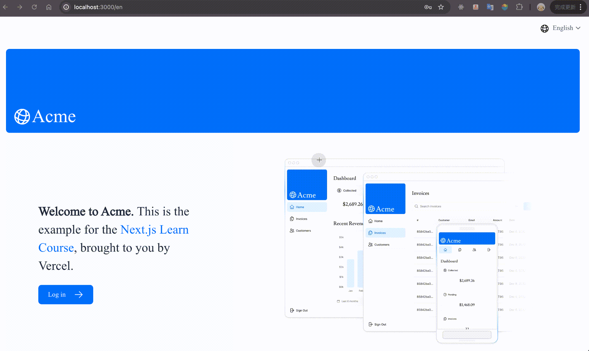

## Next.js App Router Course - Starter

This is the starter template for the Next.js App Router Course. It contains the starting code for the dashboard application.

For more information, see the [course curriculum](https://nextjs.org/learn) on the Next.js Website.

## Integrate internalization with [next-intl](https://next-intl-docs.vercel.app/)

In this tutorial demo, i've added internalization with [next-intl](https://next-intl-docs.vercel.app/), and config Next middleware with [NextAuth](https://next-auth.js.org/). The locales include English and Chinese.

And this is the [demo](https://nextjs-tutorial-with-internationalization.vercel.app/), below is the screenshot.
If you want to login, here are the email and password, same as [Next.js tutorial](https://nextjs.org/learn/dashboard-app/adding-authentication) :

Email: `user@nextmail.com`

Password: `123456`

